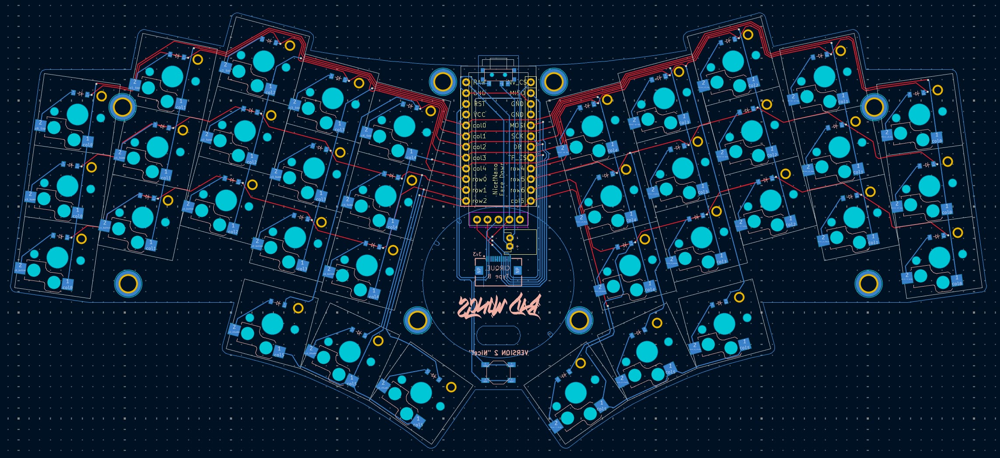

# Bad Wings "Nice!"

A variant of [Hazel](https://github.com/hazels-garage/)'s popular [Bad Wings](https://github.com/hazels-garage/bad-wings/tree/master/v2) keyboard adapted to use the Nice!Nano microcontroller. Hazel mentioned this should exist recently, and now it does. This was a fun weekend lark that I have no intention of ever personally fabricating. Consider this an unofficial dabbling in the [Democratic Ergonomic Keyboard](https://github.com/the-democratic-ergo-keyboard/manifesto) initiative.

It uses a standard Nice!Nano stack. The microcontroller should be mounted face-down on a socket. There should be enough room underneath the microcontroller to house a LiPo battery. You can attach it via a JST header, or just solder it directly onto a board. A small slide switch breaks the connection to the battery's ground to turn the microcontroller on and off.

A footprint has been added for a Nice!View display. There were *just* enough pins to give the Nice!View and the Cirque trackpad header their own dedicated CS pins. I haven't tested them in tandem together. I also haven't written a ZMK firmware for this keyboard. Again, I've never actually built this.

There's a chance the bottom piece of the existing 3D printed case would fit this keyboard. The PCB outline hasn't changed. The power switch should overlap with the existing USB port cutout. The Cirque trackpad header was moved down several millimeters to make room for the Nice!View header. The switch plate and top piece may need adjustments to account for the Nice!Nano stack's height. As originally designed, the Nice!View display and trackpad will overlap.

The key switches are Choc spaced. The stems are Choc v2 compatible however. I believe there's some 3D printed keycaps that support Choc v2 switches but are Choc v1 spaced, so this board should be usable with either switch.

## Features

- 36 key unibody split
- Choc v1 spaced, Choc v1 and v2 supported, column staggered layout
- Gentle splay on ring and pinky columns
- Nice!Nano compatible
- Nice!View support
- Cirque touchpad support
- Built in mounting standoffs
- 3D Printed Case?

## Special Thanks

[Hazel](https://github.com/hazels-garage/) for designing the original [Bad Wings](https://github.com/hazels-garage/bad-wings/tree/master/v2) keyboard, and Fingerpunch's regular cast of Discord characters encouraging me to actually finish routing this.

Let me know if you actually make this. Good luck.